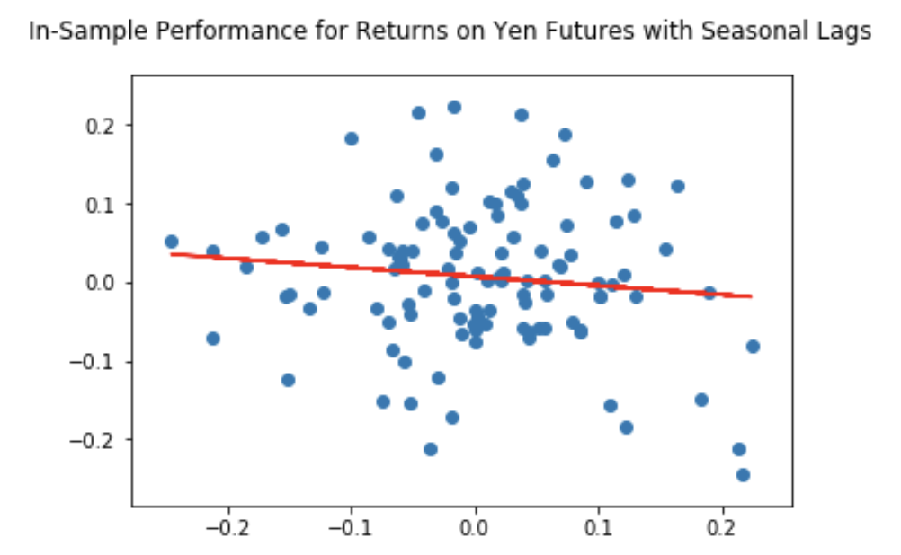

# timeseries-homework

# Unit 10—A Yen for the Future

## **_Zooming in Yen Futures_**

While Zoom is trending up, we decide to "zoom" in Yen Futures. Time series and regression analysis are conducted on historical records of Yen futures starting from 1990. Futures on Yen is interpreted as the amount in Japanese Yen bought by one U.S. dollar. Based on outputs, GARCH(2,1) model is robust for yen futures while its

## **1. Time Series Forecasting**
Since we are interested in future movements of yen, a time series analysis is one go-to method. Before we decide on the model, let's take a look at the yen daily futures settlement prices in the past three decades below:

In the graph above, we see cyclical movement with waves peak in 1996, 2000, 2006, 2012, 2017. Two top ones took place in 2012 and 1996. It suggests that Yen depreciated the most against US dollars in those years.

Furthermore, there appears to be a long-term strengthening of US Dollar against Yen. The depreciation of Yen could serve to improve the balance of trade in Japan. There do seem to be some more medium consistent trends over one, three or five years. However, on a daily basis, there are a lot of short-term ups and downs.

An **_Ad-Fuller test_** on the settlement prices of Yen concludes there is trend over time as its p-value is 0.138, greater than the 10% probability to be statistically significant. We failed to reject the null hypothesis that the yen futures are non-stationary. 

_**Results from ACF and PACF**_
* According to the **_autocorrelation_** graph, potentially all lags need to be included in the model as all of them appear to be significant, i.e. outside the shaded zone around the x-axis for time.
* Based on the figure of **_partial autocorrelation_**, on the other hand, only the first lag is helpful to be included in the time-series model. In other words, most of the trends can be explained by the first lag. 
    * It is possible for the second lag to be included as well since it is on the boarder of the shaded zone indicating statistical significance. 

_**Hodrick-Prescott Filter**_

Next, we decompose the daily Yen settlement prices into a trend and noice using Hodrick-Prescott Filter.

Smoothing with the filter and plotting the resulting trend against the actual futures settlements. Short term fluctuations would represent profitable trading opportunities. For example, when the orange line for trend runs above the blue actual settlement, it could signal that Yen is temporarily more undervalued than it should be. A US dollar is predicted to trade for more yen than the actual quote. Therefore, we'd buy or long Yen short-term.

Noises from filter deviates around a mean of zero as follows:

_**ARMA Forecast**_

Shall we long or short yen?

In order to answer the question, an ARIMA(2,1) model is built. Returns are calculated by taking the daily percent changes on quotes of yen futures settlement.

<blockquote>
Yt = beta1*(Y_t-1) + beta2*(Y_t-2) + alpha1*(e_t-1)
</blockquote>

Since p-values for AR(1), AR(2), MA(1) are 0.421, 0.810, 0.921, 0.818 respectively, none of those are less than 0.05. The model is not statistically significant enough to be a good fit for returns on yen futures based on the data.

A _**five-day forecast**_ on returns of yen futures settlement prices shows decreasing positive returns on settlement quotes. One USD is predicted to exchange for more yen over the next five days. The rate of increase would drop from 1.2 basis points on the next day to the lowest of 0.5 basis points on the second day then bouncing back to a range of 0.63 to 0.68 basis point in the following three days. Hence, we should buy or long yen futures in order to lock up the price for exchange in a future point in time. 

_**ARIMA Forecast**_

Since our ARMA(2,1) model on returns is not convincing due to insignificant p-values on coefficients of model terms, we decided to put together an ARIMA(5,1,1) model on yen settlement prices with AR(5), DIFF(1) and MA(1). The idea is supported by the partitial autocorrelation plot that suggests possibility of a three or five-day lagging period.

The output shows that the settlement price today is positively correlated with that of the previous couple of days' because coefficients of AR(1) and AR(2) are positive. On the other hand, however, yen settlements three to five days before contribute negatively to its price today. Moreover, the moving average error term is moving in oppositive directions to the price today. 

The p-values for all coefficients are greater than 0.3. Therefore, the ARIMA(5,1,1) model on raw Yen settlement prices is not statistically significant. Thus, it is not a good fit based on historical performances. We would not feel too confident in trading based on this result. 

The figure below shows **_five-day forecast_** of yen futures settlement prices based on ARIMA(5,1,1) model. As the price is expected to rise, it is an buying opportunity now to lock up the price to purchase yen in the future. We see the price curve rise at a decreasing speed that is consistent with our conclusion on the ARMA(2,1) model for returns on yen futures. Potential hedging strategy involves purchasing yen futures, long USD and short JPY.

_**GARCH Forecast on Volatilities**_

A GARCH(2,1) model on yen futures returns shows robust output on covariance estimator. It infers heteroskedasticity on returns for yen futures. There are statistically significant alpha1 and beta1 terms. The model implies that 3.8% of today's volativity gets positively passed onto from yesterday. Besides, yesterday's moving average could explain 95.4% of today's.

_Conclusion on GARCH(2,1) on Yen Futures Returns_

* After taking heteroskedasticity into account, the GARCH(2,1) on returns of Yen futures settlement prices is a better model than ARMA(2,1) on returns and ARIMA(5,1,1) on settlement prices as the coefficient of baseline variance term (omega), coefficient for moving averages (beta), how much previous' day's volatility add to today's (alpha1) are statistically significant. Their p-values are less than 0.025.
    * Omega is close to zero as we initialized it to be. The variance is zero if there were no information from the past variances being passed onto today.
    * beta1 is the moving average term of this GARCH(2,1) model. Beta1=0.9536 means 95.36% of today' returns can be explained by that of the last settlement date on Yen futures. This term should be less than 1. 
    * alpha1 suggests 3.8% of the previous day's volatility would be passed onto today's volatility
    * alpha2 is statistically insignificant so the second to the last day's volatility contribute little to that of today's.

* Note: to ensure staionarity, the sum of alphas and beta(s) are less than one. 

As shown below, the plots of residuals and annualized conditional volatility on the GARCH(2,1) model sugguests that volatilities of returns on yen futures have become calmer over the past thirty years. 

A five-day forecast for JPY futures returns suggests an upward sloping staight line. The figure below displays our conclusions from the output statistics. Volatilities on returns grow higher over time. The constant rate of increase is passed on from volatility of the returns from the previous day. Over the five-day window, volatility on yen futures returns would increase by 0.17% to 7.6%. 

Because GARCH output is statistically robust, we should be more confident trading based on information implied by this GARCH(2,1) model. 

**Based on your time series analysis, would you buy the yen now?**
* According to the graph above on Garch(2,1) forecast, the returns on yen futures is expected to increase. That means we should buy Yen futures now and lock up the price to purchase Yen on a certain date in the future. It is supported by the forecast from ARIMA(5,1,1) model that the raw settlement price of Yen is expected to rise in the next five days, meaning one dollar can purchase more Yen in the next week. 

**Is the risk of the yen expected to increase or decrease?**
* Based on Garch(2,1), the risk of Yen is expected to rise in the next five days while staying relatively quiet for a period of time in the long run. The volatility will keep quiet as the sum of beta1 and alpha1 is 0.99 < 1. If it were one, we have a random walk. It is consistent with the plots on residuals and conditional volatilities on Yen futures returns above.

Based on the model evaluation, would you feel confident in using these models for trading?
* I would trade based on Garch(2,1) model because of its statistically significant omega, beta1 and apha1 coefficients. Besides, it has the lowest AIC and BIC scores out of the three models. 
    * In comparison, I am not comfortable trading based on ARCH(2,1) and ARIMA(5,1,1) models as none of the parameters of the models are statistically significant for the training data. 

* Based on the following seasonal decomposition, it is observed that Yen settlement price spike during the second and third quarters of a year. Therefore, seasonality will be taken into consideration for trading as well. 
    * Since the last record date was November 15, 2019, it may not be as profitable choosing to hold the Yen futures contracts for too long even though the Garch(2,1) forcasts an increase in returns. 

_**Further Analysis: Do people need more JPY for the summer?**_

A possible direction to identify a better model is to look for underlying seasonality in the data. A seasonal decomposition is plotted below on average monthly yen settlement prices. 

From the decomposed plot on seasonal effects, there is a cyclical movement with settlement prices. Quotes increase starting from the second season to the third season of a year approximately. Decreases in settlement prices occur roughly during the fourth season of a year and last into the first season of the following year. 

We will further explore seasonal effects in the linear regression analysis below. 

## **2. Linear Regression Modeling**

We explore seasonal effects by setting lagged JPY futures returns to daily, weekly, monthly and seasonal averages. A series of models are propsed using lagging periods by day, month, season, windows of 26 weeks, half a year and multiple months. Dummy variables are created for analysis of weekly, monthly and seasonal effects. Rolling linear regressions are performed to make the model structures more rigorous. Results from output statistics are compared to conclude the model that best captures the features of underlying data. 

The models are fitted using training period from 1990 to 2017. The testing data are based on historical yen futures returns from 2018 to 2019.

Regression models are named based on their period of lags, dummy variables and how lagged returns are calculated. Statistics that  measures robustness of linear models are:
* Root Mean Squred Errors (RMSE)
* R-squared (R2)

_**Rule of Thumb**_: For models of good fit, we are looking for those with lower RMSEs and higher R2s.

The following is a table of statistics on `linear regression models` that were performed using Sklearn in python:

| Model                         | Out-of-Sample RMSE | Out-of-Sample R2 | In-Sample RMSE | In-Sample R2 |         
|-------------------------------|--------------------|------------------|----------------| -------------|
| `Daily`                       | 0.4137             | 0.0010           | 0.7059         | 0.0001       |
| `Daily_Week_Dummies`          | 0.4160             | -0.0105          | 0.7026         | 0.0094       |
| `Daily_DayofWeek_Dummies`     | 0.4159             | -0.010           | 0.7053         | 0.0019       |
| `Daily_Month_Dummies`         | 0.4152             | -0.0064          | 0.7055         | 0.0015       |
| `Daily_Season_Dummies`        | 0.4142             | -0.0016          | 0.7059         | 0.0004       |
| `Daily_Summer_Winter_Dummies` | 0.4142             | 0.0001           | 0.7059         | 0.0003       |
| `Daily_Fall_Dummies`          | 0.4139             | -0.0003          | 0.7059         | 0.0003       |
| `Daily_Rolling_36_Weeks`      | 0.6961             | -0.0031          | NA             | NA           |
| `Daily_Rolling_26_Weeks`      | 0.7000             | -0.0032          | NA             | NA           |
| `Monthly_Avg`                 | 0.0888             | -0.0085          | 0.1495         | 0.0028       |    
| `Monthly_Rolling_9_Months`    | 0.1714             | -0.3794          | NA             | NA           |
| `Seasonal_Avg`                | 0.0675             | 0.0328           | 0.0910         | 0.0136       |
| `Seasonal_Rolling_3_Seasons`  | 0.1286             | -1.0262          | NA             | NA           |
| `Seasonal_Rolling_7_Seasons`  | 0.1052             | -0.3315          | NA             | NA           |

_**Please see conclusions and plots for the above models as follows:**_

`Daily`

**_Conclusion_**: The root MSEs are 0.4137 for out-of-sample performance and 0.7059 for in-sample performance while R-squares are close to zero, 0.01 and 0.001 respectively, we conclude that the above OLS regression is not a statistically enough to represent the data provided.

`Daily_Week_Dummies`

**_Conclusion_**: This OLS linear regression model is not a statistically enough to represent the data provided based on both in and out-of-sample high RMSEs and low R2s.

`Daily_DayofWeek_Dummies`

**_Conclusion_**: This OLS linear regression model is not a statistically enough to represent the data provided based on both in and out-of-sample high RMSEs and low R2s.

`Daily_Month_Dummies` 

**_Conclusion_**: This OLS linear regression model is not a statistically enough to represent the data provided based on both in and out-of-sample high RMSEs and low R2s.

`Daily_Season_Dummies`

**_Conclusion_**: This OLS linear regression model is not a statistically enough to represent the data provided based on both in and out-of-sample high RMSEs and low R2s.

`Daily_Summer_Winter_Dummies`

**_Conclusion_**: This OLS linear regression model is not a statistically enough to represent the data provided based on both in and out-of-sample high RMSEs and low R2s.

`Daily_Fall_Dummies` 

**_Conclusion_**: This OLS linear regression model is not a statistically enough to represent the data provided based on both in and out-of-sample high RMSEs and low R2s.

`Daily_Rolling_36_Weeks`

**_Conclusion_**: This OLS linear regression model is not a statistically enough to represent the data provided based on both out-of-sample high RMSEs and low R2s.
* A rolling training window of 9 months, i.e. 36 weeks, with time frame of 321 in iterations

`Daily_Rolling_26_Weeks`

**_Conclusion_**: This OLS linear regression model is not a statistically enough to represent the data provided based on both out-of-sample high RMSEs and low R2s.
* A rolling training window of 6.5 months, i.e. 26 weeks, with time frame of 1528 in iterations

.png)

.png)

`Monthly_Avg` 

**_Conclusion_**: This OLS linear regression is a better model.

* Average monthly returns with one lag 

`Monthly_Rolling_9_Months`

**_Conclusion_**: This OLS linear regression model is a better model.

* Average monthly returns with rolling period of 9 months and 347 iterations

`Seaonal_Avg` 

**_Conclusion_**: This OLS linear regression is a better model.

* Average seasonal returns with rolling period of 9 months and 347 iterations

`Seasonal_Rolling_3_Seasons`

**_Conclusion_**: This OLS linear regression is a better model.

* Average seasonal returns with rolling period of 3 seasons and iteration over a time frame of 115 seasons

`Seasonal_Rolling_7_Seasons`

**_Conclusion_**: This OLS linear regression is a better model.

* Average seasonal returns of one lag are tested with prior rolling period of multiple seasons 
* A 7-season rolling window provides the lowest RMSEs and highest R2s with iteration time frame of 111 seasons

- - -
### **Conclusions:**

* The best linear regression models are as follows:
    * For test statistics
        * `Seasonal_Rolling_3_Seasons`
        * `Monthly_Avg`  
        * `Seasonal_Avg`  
        * `Seasonal_Rolling_7_Seasons` 
        * `Monthly_Rolling_9_Months`
    * For combination of rigorous structure and test statistics, in that order
        1. `Seasonal_Rolling_3_Seasons`
        2. `Seasonal_Rolling_7_Seasons`
        3. `Monthly_Rolling_9_Months`

* Out-of-Sample performance has higher R2s and lower RMSEs for each of the models because they have more data
    * One year of testing data vs. 27 years of training data

* The fall seasonal dummy produces output statistics close to those of summer_winter dummies due to possible following reasons: 
    * Travel is most frequent during months of August to October
    * School starts in the fall

- - -

### Files

[Time-Series Forecasting Notebook](Answers/Code/time_series_analysis.ipynb)

[Linear Regression Modeling Notebook](Answers/Code/regression_analysis.ipynb)

[Yen Data CSV File](Answers/Code/yen.csv)

- - -

# References:
* CU Bootcamp GitLab
* https://stackoverflow.com/questions/18691084/what-does-1-mean-in-numpy-reshape
* https://stackoverflow.com/questions/17679089/pandas-dataframe-groupby-two-columns-and-get-counts
* https://stackoverflow.com/questions/44124436/python-datetime-to-season
* https://stackoverflow.com/questions/25146121/extracting-just-month-and-year-separately-from-pandas-datetime-column
* https://pypi.org/project/arch/4.13/
* https://machinelearningmastery.com/develop-arch-and-garch-models-for-time-series-forecasting-in-python/
* http://www.blackarbs.com/blog/time-series-analysis-in-python-linear-models-to-garch/11/1/2016#ARMA
